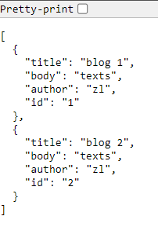

# JSON

```
npx json-server --watch data/db.json --port 8000
```

automatically goes to port 3000.

if we now go to the resources (endpoints):



however, we are not using browsers to get that data, instead, we use fetch requests on different endpoints.

### Endpoints

\*not all, just the ones we are using

1. /blogs GET fetch all blogs
2. /blogs/{id} GET fetch a single blog
3. /blogs POST add a new blog
4. /blogs/{id} DELETE delete a blog
