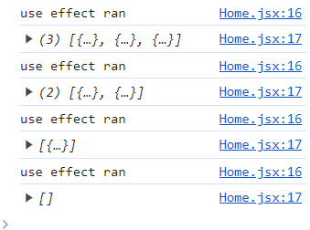

# UseEffect

## What it does

Runs a function every render of a component. Component first loads and renders to DOM, also re-renders the DOM when state changes, useEffect is used to run something every render.

in this example, if we change the state for blogs (delete), the useEffect will run.

```
 useEffect(() => {
    console.log("use effect ran");
  });
```



sometimes the useEffect function might trigger state changes, causing infinite loops inside the function.

## Dependencies

sometimes we do not want to run the function every render, only on certain ones.

### Dependency array

an array to pass into the useEffect hook as the second argument.

```
  useEffect(() => {
    console.log("use effect ran");
    console.log(blogs);
  }, []);
```

this means, the useEffect hook only runs the function after the **initial** render. (once)
